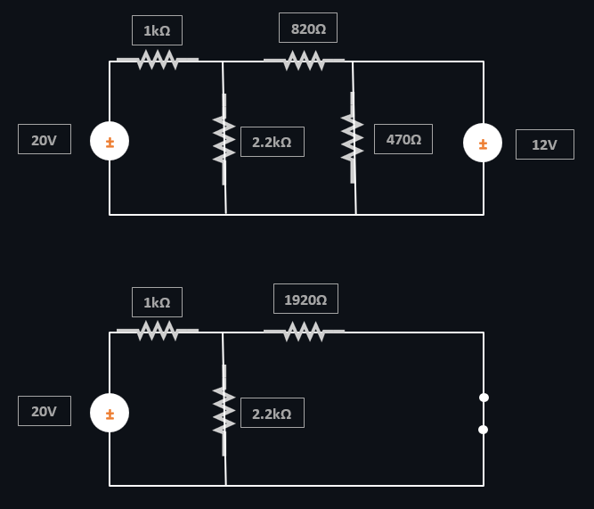
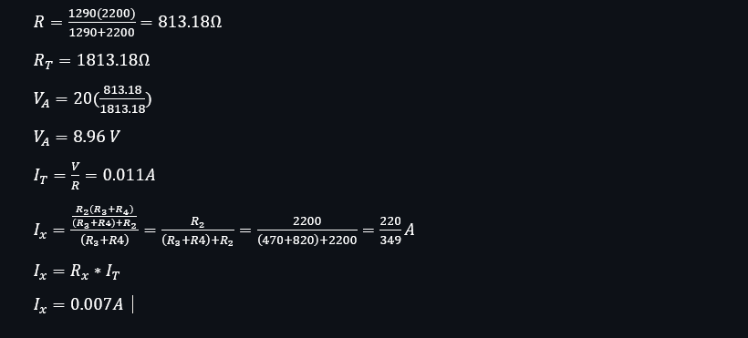
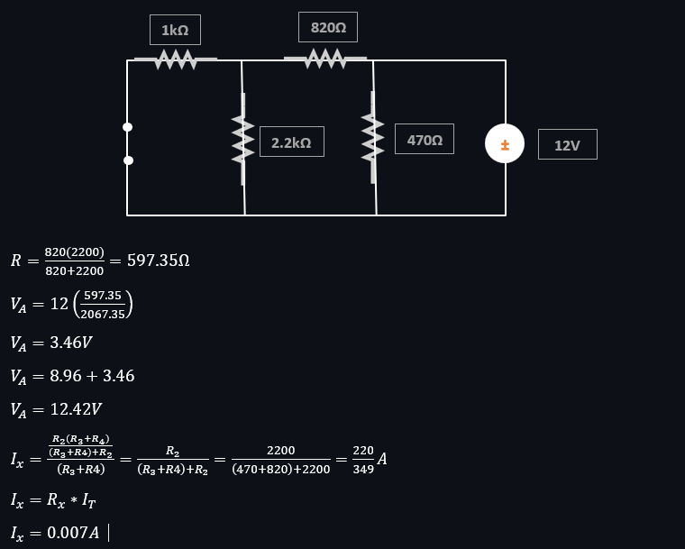
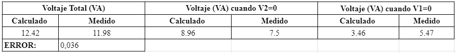
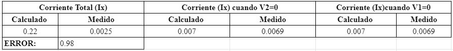

# Laboratorio-4

1. OBJETIVO GENERAL 

•	Explicar el teorema y sus conceptos de superposición utilizados en el circuito planteado para estudiar valores de tensión de un nodo y valores de corriente en un circuito con más de una fuente independiente. 

Objetivos específicos:

•	Determinar los valores desconocidos del circuito ejecutado en el informe, mediante cálculos y ecuaciones encontradas.

•	Desarrollar en el simulador con los conocimientos adquiridos en prácticas, el circuito de tal forma que coincidan los valores medidos con los valores encontrados mediante las ecuaciones de superposición.
    
2. MARCO TEÓRICO

3. EXPLICACIÓN DEL PROCEDIMIENTO

Circuito Analítico

Circuito Simulado

Materiales

4. RESPUESTA A INTERROGANTES Y CALCULO DEL ERROR

Tabla 4.1. Medición de voltaje aplicando superposición.

Tabla 4.2. Medición de corriente aplicando superposición.

5. VIDEO
https://youtu.be/29hgKSD_Uus

6. CONCLUSIONES

•	De todo lo anterior se deduce que en la práctica del laboratorio podemos comprobar la teoría en este caso de superposición, y con la ayuda de estas fórmulas poder encontrar los valores no conocidos

•	El análisis expuesto nos indica que el voltaje o corriente total se calcula como la suma algébrica de las contribuciones de las fuentes.

•	De esta forma para usar el teorema de superposición con corrientes y voltajes de circuito todos los componentes deben ser lineales, comprobando así una de las leyes mas conocidas como lo es la ley de Ohm. 

•	En conclusión, para poder simplificar el circuito planteado una de las formas para que este se pueda resolver de una manera menos complicada es volver a redibujar el esquema y poder encontrar y comparar los valores mediante nodos, mallas y todas las fórmulas ya conocidas anteriormente.

Bibliografía 

Matethew. (24 de Marzo de 2017). Análisis de circuitos por teoremas. Obtenido de https://analisisdecircuitosporteoremascd.blogspot.com/2017/03/analisis-de-nodos-y-supernodos.html

Mi electronica fácil. (24 de Julio de 2018). Obtenido de https://mielectronicafacil.com/analisis-de-circuitos/teorema-de-nodos/#page-content
